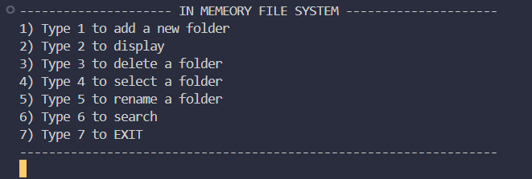
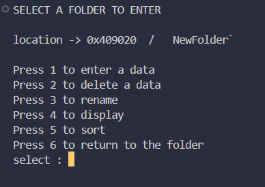

# 📁 File Folder System in C++

> 🚀 A console-based file/folder management system created using **pure DSA (Data Structures & Algorithms)** — all implemented manually without built-in libraries.  
> Created using **C++** as a core learning project for practicing arrays, queues, searching, and sorting.

---

## 🧠 Description

This project simulates a basic file and folder structure, allowing the user to manage folders and their respective files through a **menu-driven interface**.  
It mimics how actual file systems work — but at a simplified level — built completely using **custom data structures**.

---

## 🔧 Tech & Concepts Used

- **Language**: C++
- **Data Structures**:
  - Arrays
  - Queue
- **Algorithms**:
  - Searching
  - Sorting
- **Concepts**:
  - Menu-driven logic
  - Procedural programming
  - File/folder simulations in memory

---

## 📂 Folder Operations

```
Add a new folder
Display all folders
Delete a folder
Select a folder
Rename a folder
Search for a folder
EXIT
```

---

## 📄 Other Operations (Inside a Folder)
```
Enter file data
Delete a file
Rename a file
Display files
Sort files
Return to folder view
```

---

## 🖼️ Screenshots

### 🔍 Main Folder Operations


### 📄 More Control (Inside a folder)


